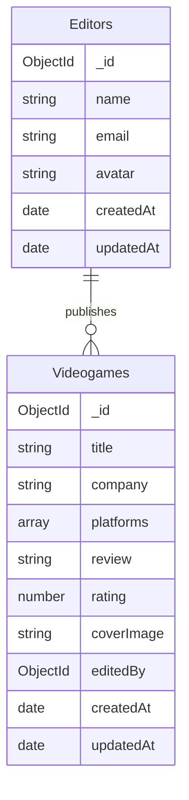

# Videogames API

API REST construida con **Node.js**, **Express** y **MongoDB (Mongoose)** para la gestión de editores y videojuegos con sistema de críticas y opiniones.

Permite crear, leer, actualizar y eliminar entidades, con soporte para **subida de archivos a Cloudinary** para avatares de editores y portadas de videojuegos.

Los editores pueden publicar múltiples críticas u opiniones sobre videojuegos, estableciendo una relación directa entre ambas colecciones.

El proyecto incluye un script de seed que inicializa la base de datos con un conjunto de editores y videojuegos predefinidos.
Durante la ejecución del seed, las imágenes locales de cada editor y videojuego se suben automáticamente a Cloudinary, garantizando que todas las entidades iniciales cuenten con sus respectivos avatares y portadas desde el primer arranque.

---

## Instalación y uso

1. Clona el repositorio:

   ```bash
   git clone https://https://github.com/AleixSu/Project08.API_REST_FILES
   ```

2. Accede al directorio del proyecto:

   ```bash
   cd tu-repositorio
   ```

3. Instala dependencias:

   ```bash
   npm install
   ```

4. Configura las variables de entorno en un archivo `.env`:

   ```env
   DB_URL=mongodb+srv://<USER>:<PASSWORD>@cluster.mongodb.net/videogamesDB
   CLOUDINARY_CLOUD_NAME=tu_cloud_name
   CLOUDINARY_API_KEY=tu_api_key
   CLOUDINARY_API_SECRET=tu_api_secret
   PORT=3000
   ```

5. Inicia el servidor:
   ```bash
   npm run dev
   ```
   Por defecto la API corre en:  
   `http://localhost:3000/api/v1`

---

## Endpoints disponibles

### Editors

Base: `/api/v1/editors`

| Método | Endpoint | Descripción                    | Archivos         |
| ------ | -------- | ------------------------------ | ---------------- |
| GET    | `/`      | Obtiene todos los editores.    | -                |
| GET    | `/:id`   | Obtiene un editor por ID.      | -                |
| POST   | `/`      | Crea un nuevo editor.          | `avatar` (field) |
| PATCH  | `/:id`   | Actualiza un editor existente. | `avatar` (field) |
| DELETE | `/:id`   | Elimina un editor.             | -                |

#### Ejemplo de body para POST (form-data)

```
name: John Doe
email: john@example.com
avatar: [archivo de imagen]
```

---

### Videogames

Base: `/api/v1/videogames`

| Método | Endpoint              | Descripción                                 | Archivos             |
| ------ | --------------------- | ------------------------------------------- | -------------------- |
| GET    | `/`                   | Obtiene todos los videojuegos.              | -                    |
| GET    | `/:id`                | Obtiene un videojuego por ID.               | -                    |
| GET    | `/editor/:editor`     | Filtra videojuegos por editor usando su ID. | -                    |
| GET    | `/platform/:platform` | Filtra videojuegos por plataforma.          | -                    |
| POST   | `/`                   | Crea un nuevo videojuego.                   | `coverImage` (field) |
| PATCH  | `/:id`                | Actualiza un videojuego existente.          | `coverImage` (field) |
| DELETE | `/:id`                | Elimina un videojuego.                      | -                    |

#### Ejemplo de body para POST (form-data)

```
title: The Legend of Zelda: Breath of the Wild
company: Nintendo
platforms: Switch,PC
review: Una obra maestra del diseño de mundos abiertos
rating: 9.5
coverImage: [archivo de imagen]
editedBy: 507f1f77bcf86cd799439011
```

#### Plataformas válidas

- `PC`
- `Xbox`
- `PS5`
- `Switch`

---

## Relaciones entre colecciones



**Relación:** Un editor puede publicar múltiples videojuegos (1:N).

---

### Diagrama conceptual de colecciones

```
+------------+       1        *       +------------+
|  Editors   |----------------------->| Videogames |
+------------+                        +------------+
| _id        |                        | _id        |
| name       |                        | title      |
| email      |                        | company    |
| avatar     |                        | platforms  |
| createdAt  |                        | review     |
| updatedAt  |                        | rating     |
+------------+                        | coverImage |
                                      | editedBy   |
                                      | createdAt  |
                                      | updatedAt  |
                                      +------------+
```

---

## Tecnologías usadas

- Node.js + Express
- MongoDB + Mongoose
- Cloudinary (almacenamiento de archivos)
- Multer + Multer-Storage-Cloudinary
- dotenv
- nodemon (dev)

---

## Gestión de archivos con Cloudinary

### Subida de archivos

Los archivos se suben automáticamente a Cloudinary mediante Multer:

- **Editores**: Campo `avatar`
- **Videojuegos**: Campo `coverImage`

### Eliminación de archivos

Al actualizar o eliminar registros, las imágenes previas se eliminan automáticamente de Cloudinary mediante la función `deleteFile()`.

---

## Estructura de datos

### Editor

```json
{
  "_id": "507f1f77bcf86cd799439011",
  "name": "John Doe",
  "email": "john@example.com",
  "avatar": "https://res.cloudinary.com/.../avatar.jpg",
  "createdAt": "2025-01-15T10:30:00.000Z",
  "updatedAt": "2025-01-15T10:30:00.000Z"
}
```

### Videogame

```json
{
  "_id": "507f1f77bcf86cd799439012",
  "title": "The Legend of Zelda: Breath of the Wild",
  "company": "Nintendo",
  "platforms": ["Switch", "PC"],
  "review": "Una obra maestra del diseño de mundos abiertos",
  "rating": 9.5,
  "coverImage": "https://res.cloudinary.com/.../cover.jpg",
  "editedBy": {
    "_id": "507f1f77bcf86cd799439011",
    "name": "John Doe",
    "email": "john@example.com"
  },
  "createdAt": "2025-01-15T11:00:00.000Z",
  "updatedAt": "2025-01-15T11:00:00.000Z"
}
```

---

## Seed

El proyecto incluye un archivo seed con datos de ejemplo:

- Array de **editores** con nombres, emails y avatares
- Array de **videojuegos** con títulos, compañías, plataformas, imágen, reviews y ratings

La función `seedHelper` se encarga de:

1. Insertar los editores en la base de datos
2. Reemplazar los nombres de editores en los videojuegos por sus `_id` generados
3. Insertar los videojuegos con las referencias correctas

Para ejecutar el seed:

```bash
npm run seed
```

**Nota:** El seed sube imágenes a Cloudinary automáticamente. Es importante que la dirección de la carpeta de origen dentro del folder data sea correcta.

---

## Manejo de rutas no especificadas

El servidor maneja rutas inexistentes con un middleware global que devuelve un 404:

```js
app.use((req, res, next) => {
  res.status(404).json({ error: 'Route not found' })
})
```

---

## Testing con Postman / Insomnia

1. Inicia el servidor con `npm run dev`
2. Configura las peticiones con **form-data** para endpoints que requieran archivos
3. Incluye archivos de imagen en los campos `avatar` y `coverImage`
4. Valida las relaciones usando populate en los endpoints GET

### Ejemplo de petición con archivo

```
POST /api/v1/editors
Content-Type: multipart/form-data

name: Jane Smith
email: jane@example.com
avatar: [seleccionar archivo]
```

---

## Validaciones

- **Rating**: Debe estar entre 0 y 10
- **Platforms**: Solo acepta valores: `PC`, `Xbox`, `PS5`, `Switch`
- **Email**: Formato de email válido
- **Archivos**: Solo se aceptan imágenes (jpg, jpeg, png, gif, webp)

---

## Consideraciones

- Se usa `PATCH` para actualizaciones parciales, preservando campos no enviados
- La relación `Videogame.editedBy → Editor` se muestra mediante `populate`
- Al eliminar un editor, considera eliminar o reasignar sus videojuegos asociados
- Las URLs de Cloudinary son públicas y accesibles desde cualquier lugar
